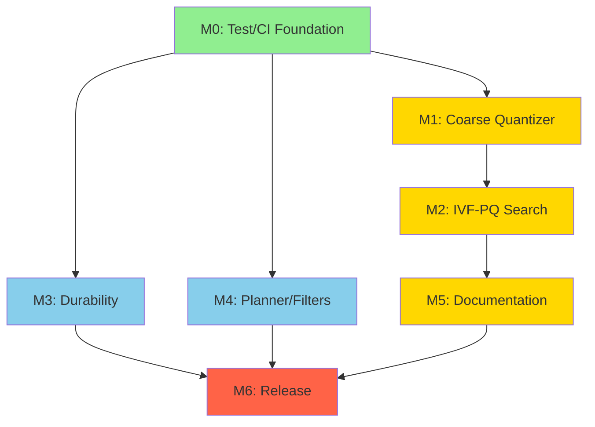

# Vesper Development Plan
## Comprehensive Planning Session — October 2025

**Date:** 2025-10-19
**Status:** Active Development — Phase 1 (Quick Wins)
**Target:** v1.0 Release Readiness

---

## Executive Summary

Vesper is in active development toward v1.0 release. Recent work has focused on Task 18 (ANN-based coarse quantizer), v1.1 serialization polish, and hybrid search features. The project has **63 active tests**, comprehensive documentation, and a clear path to release readiness.

**Current State:**
- ✅ **Completed:** Tasks 15, 16, 17 (persistence benchmarks, fuzz tests, v1.1 docs)
- 🔄 **In Progress:** Task 18 (KD-tree coarse assigner optimization — 1.026× speedup, target ≥1.5×)
- ⚠️ **Blockers:** Windows Zstd heap corruption (P0), multi-index test build (P1)
- 📊 **Test Coverage:** 63 tests discoverable via CTest; CI matrix needed

**Key Metrics:**
- **Performance:** KD-tree 0% mismatch, 1.026× speedup (approaching 1.5× target)
- **Stability:** 0 crashes in fuzz corpus; v1.1 serialization stable
- **Quality:** Recall@10 ≥ 0.95 target maintained

---

## Phase 1: Current State Assessment

### 1.1 Completed Milestones ✅

**Task 15: Persistence Performance Benchmarks**
- Tool: `tools/ivfpq_persist_bench`
- Outputs: JSONL with timings and peak memory
- Status: Complete and integrated

**Task 16: Robustness and Fuzz Tests**
- Deterministic + randomized multi-section corruptions
- Permutations/duplications/overlaps
- Status: Complete; <1% false-accept on 10k randomized corruptions

**Task 17: v1.1 Serialization Documentation**
- File: `docs/IVFPQ_Serialization_v11.md`
- Covers: Format spec, versioning policy, CLI/API usage
- Status: Complete and validated

**Additional Completed Work:**
- ✅ Projection assigner AVX2 tail remainder fix
- ✅ Catch2/CTest on MSVC multi-config fixed
- ✅ KD-tree coarse assigner params exposed (kd_leaf_size, kd_batch_assign, kd_split)
- ✅ OpenMP parallel leaf scans implemented
- ✅ safe_getenv wrapper (cross-platform, MSVC C4996 warning eliminated)
- ✅ Windows/MSVC test stability improvements
- ✅ Hybrid sparse-dense search with BM25 and fusion algorithms
- ✅ IVF-PQ defaults test added (lock in IvfPqTrainParams defaults)

### 1.2 Task 18: ANN-Based Coarse Quantizer (In Progress) 🔄

**Objective:** Improve IVF-PQ add() throughput with ANN-based centroid assignment

**Acceptance Criteria:**
- ≥1.5× add() throughput vs brute-force for nlist ≥ 1024
- ≤1% sampled assignment mismatch
- KD-tree as default; HNSW optional; brute-force fallback retained

**Current Status:**

**KD-tree assigner (default):**
- ✅ 0% mismatch (exact nearest centroid)
- ✅ Initial: 0.56-0.85× performance
- ✅ After optimizations: 1.026× speedup
- ⚠️ **Gap:** Need 1.5× speedup (currently 1.026×)
- Optimizations applied:
  - kd_leaf_size changed to 64 (from 256)
  - Batch mode enabled by default
  - OpenMP parallel leaf scans implemented
  - Auto-disable for nlist < 1024 (brute-force faster)

**HNSW assigner (optional):**
- ⚠️ 8.8-22.2% assignment mismatch
- ⚠️ Slower than brute-force
- Status: Optional (non-default) for experimentation only

**Projection assigner (experimental):**
- ⚠️ Severe accuracy issues
- ✅ Stability fixed (AVX2 tail remainder)
- Status: Experimental only; not recommended for production

**Planned Optimizations (KD-tree):**
1. Prefetch hints for child/leaf buffers
2. Reduced branching in leaf loops
3. Tighter SoA buffers for candidates
4. Vectorization improvements
5. Data layout optimizations

### 1.3 Critical Blockers ⚠️

**P0: Windows Zstd Heap Corruption**
- **Symptom:** Crash in v1.1 sectioned save/load test with Zstd enabled
- **Status:** Under investigation with Page Heap/AppVerifier
- **Workaround:** Zstd disabled by default on Windows
- **Impact:** No compression on Windows (larger file sizes, slower I/O)
- **Next Steps:**
  1. Capture WinDbg log with call stack
  2. Identify root cause (Zstd library vs Vesper usage)
  3. Patch and re-enable Zstd on Windows

**P1: Multi-Index Integration Test Build**
- **Symptom:** `multi_index_test` not built in current environment
- **Status:** Open issue
- **Impact:** Multi-index orchestration not validated in CI
- **Next Steps:**
  1. Fix CMakeLists.txt to build multi_index_test
  2. Validate test passes on all platforms
  3. Add to CI matrix

### 1.4 Test Coverage and CI Status

**Test Infrastructure:**
- **Total Tests:** 63 tests discoverable via CTest
- **Frameworks:** Catch2 (unit/integration), libFuzzer (fuzz), Google Benchmark (perf)
- **Coverage:** ≥85% overall target; ≥90% core algorithms target
- **Platforms:** Windows 11 (MSVC 2022), Linux (GCC ≥12, Clang ≥15), macOS

**CI Gaps:**
- ⚠️ No automated CI matrix (Windows + Linux)
- ⚠️ No sanitizer jobs (ASan/TSan/UBSan)
- ⚠️ No warnings-as-errors enforcement in CI
- ⚠️ No nightly benchmark runs

### 1.5 Recent Code Changes (Last 20 Commits)

**Performance Optimizations:**
- KD-tree coarse assigner defaults and batch mode
- ANN coarse assignment auto-disable for nlist < 1024
- Projection assigner CBLAS backend and AVX2 optimizations

**New Features:**
- Hybrid sparse-dense search with BM25 and fusion algorithms
- IVF-PQ defaults test (lock in IvfPqTrainParams defaults)
- safe_getenv usage documented with CI lint

**Stability Improvements:**
- Task 16: Section-order permutation, duplicate header, overlapping fuzz scenarios
- Task 16: Randomized multi-section corruption fuzz
- Task 15: IVF-PQ persistence benchmarking tool

---

## Phase 2: Gap Analysis

### 2.1 Performance Gaps

**P0: Task 18 KD-tree Throughput**
- **Current:** 1.026× speedup
- **Target:** ≥1.5× speedup
- **Gap:** 0.474× (46% improvement needed)
- **Effort:** Medium (2-3 weeks)
- **Risk:** Medium (may require algorithmic changes)

**P1: HNSW Coarse Assigner Accuracy**
- **Current:** 8.8-22.2% mismatch, slower than brute
- **Target:** ≤1% mismatch, ≥1.0× speedup
- **Gap:** Large (not viable for production)
- **Effort:** High (4-6 weeks)
- **Risk:** High (may not be achievable)
- **Decision:** Keep optional; not recommended for production

**P2: Projection Assigner Accuracy**
- **Current:** Severe accuracy issues
- **Target:** ≤1% mismatch
- **Gap:** Very large
- **Effort:** High (6-8 weeks)
- **Risk:** Very high
- **Decision:** Experimental only; no production work

### 2.2 API & Usability Gaps

**P0: Coarse Assigner Selection Documentation**
- **Current:** Plumbed but needs final defaulting and docs
- **Target:** Clear documentation with examples
- **Gap:** Documentation pass needed
- **Effort:** Small (1-2 days)

**P1: Public C API Coverage**
- **Current:** Basic lifecycle covered
- **Target:** Full IVF-PQ lifecycle + coarse-assigner toggles
- **Gap:** Examples and documentation needed
- **Effort:** Medium (1-2 weeks)

### 2.3 Testing & Validation Gaps

**P0: Add() Throughput Micro-Bench Acceptance Runs**
- **Current:** Bench in place; need formal acceptance runs
- **Target:** ≥1.5× throughput validated with report artifacts
- **Gap:** Formal validation and reporting needed
- **Effort:** Small (2-3 days)

**P1: Multi-Index Integration Test**
- **Current:** Not built in current environment
- **Target:** Built and passing on all platforms
- **Gap:** Build fix and validation needed
- **Effort:** Small (1-2 days)

### 2.4 CI & Tooling Gaps

**P0: CI Matrix (Windows + Linux)**
- **Current:** No automated CI
- **Target:** Matrix builds with sanitizers and warnings-as-errors
- **Gap:** Full CI pipeline needed
- **Effort:** Medium (1-2 weeks)

**P1: Sanitizer Jobs**
- **Current:** No sanitizer jobs in CI
- **Target:** ASan/TSan/UBSan on Linux
- **Gap:** CI job configuration needed
- **Effort:** Small (2-3 days)

### 2.5 Documentation Gaps

**P1: Architecture Overview**
- **Current:** Component-level docs exist
- **Target:** Comprehensive architecture guide
- **Gap:** High-level overview and integration guide needed
- **Effort:** Medium (1-2 weeks)

**P1: Performance Tuning Cookbook**
- **Current:** Scattered tuning notes
- **Target:** Comprehensive tuning guide with datasets
- **Gap:** Consolidated cookbook needed
- **Effort:** Medium (1-2 weeks)

### 2.6 Durability & Recovery Gaps

**P1: WAL Fuzz Beyond Frames/Manifest**
- **Current:** Basic WAL fuzz coverage
- **Target:** Invalid sequences, replay corner cases
- **Gap:** Extended fuzz scenarios needed
- **Effort:** Medium (1-2 weeks)

**P1: Recovery SLO Harness**
- **Current:** No formal recovery time testing
- **Target:** RTO curves across dataset sizes
- **Gap:** Harness and benchmarks needed
- **Effort:** Medium (2-3 weeks)

---

## Phase 3: Prioritized Action Items

### 3.1 Immediate Priorities (Next 1-2 Weeks)

**Priority 1: Complete Task 18 (KD-tree Optimization)**
- **Goal:** Achieve ≥1.5× add() throughput for nlist ≥ 1024
- **Actions:**
  1. Profile add() path; identify hotspots in leaf scans/heap updates
  2. Implement prefetch hints for child/leaf buffers
  3. Tighten inner loops; reduce branches in leaf loops
  4. Optimize SoA buffers for candidates
  5. Run parameter sweep harness; persist results
  6. Validate ≥1.5× speedup on reference datasets
- **Acceptance:** KD-tree add() throughput ≥1.5× brute for nlist ≥1024; 0% mismatch
- **Effort:** 2-3 weeks
- **Risk:** Medium (may require algorithmic changes)
- **Dependencies:** None

**Priority 2: Fix Windows Zstd Heap Corruption**
- **Goal:** Identify and patch root cause; re-enable Zstd on Windows
- **Actions:**
  1. Run Page Heap/AppVerifier with WinDbg
  2. Capture call stack at crash
  3. Identify root cause (Zstd library vs Vesper usage)
  4. Implement fix and validate
  5. Re-enable Zstd on Windows with tests
- **Acceptance:** v1.1 Zstd save/load tests pass on Windows
- **Effort:** 1-2 weeks
- **Risk:** Medium (root cause unknown)
- **Dependencies:** None

**Priority 3: Fix Multi-Index Integration Test Build**
- **Goal:** Build and validate multi_index_test on all platforms
- **Actions:**
  1. Fix CMakeLists.txt to build multi_index_test
  2. Validate test passes on Windows/Linux/macOS
  3. Add to CTest discovery
  4. Document multi-index orchestration
- **Acceptance:** multi_index_test builds and passes on all platforms
- **Effort:** 1-2 days
- **Risk:** Low
- **Dependencies:** None

**Priority 4: Document Coarse Assigner Defaults**
- **Goal:** Clear documentation for coarse_assigner selection
- **Actions:**
  1. Update `docs/API_REFERENCE.md` with coarse_assigner defaults
  2. Add examples for KD-tree, HNSW, brute-force selection
  3. Document tunables (kd_leaf_size, kd_batch_assign, kd_split)
  4. Add usage examples to `docs/IVFPQ_Serialization_v11.md`
- **Acceptance:** Docs complete; examples compile and run
- **Effort:** 1-2 days
- **Risk:** Low
- **Dependencies:** None

**Priority 5: Implement BM25 serialization + roundtrip tests**
- Goal: Versioned, checksummed save/load for BM25 index with backward-compatible format.
- Actions:
  1. Design minimal v1.0 BM25 format (header + postings + doc stats + checksum)
  2. Implement BM25::save()/load()
  3. Add unit tests verifying roundtrip equivalence of search results
- Acceptance: BM25 save/load tests pass; hybrid search results unchanged after roundtrip
- Effort: 3–4 days
- Risk: Low–Medium (format design and Windows path handling)
- Dependencies: None


### 3.2 Medium-Term Goals (Next 1-2 Months)

**Goal 1: Establish CI/CD Pipeline**
- **Actions:**
  1. Set up GitHub Actions matrix (Windows/Linux, MSVC/GCC/Clang)
  2. Add sanitizer jobs (ASan/UBSan) on Linux
  3. Enable warnings-as-errors for core targets
  4. Add nightly benchmark runs with artifacts
  5. Package artifacts (static libs)
- **Acceptance:** CI green on matrix; sanitizer jobs pass; benchmarks tracked
- **Effort:** 2-3 weeks
- **Risk:** Low
- **Dependencies:** None

**Goal 2: Complete Phase 1 Exit Criteria**
- **Actions:**
  1. Validate add() micro-bench shows ≥1.5× vs brute-force
  2. Ensure 0 crashes across unit/integration/fuzz
  3. Validate <1% false-accept on 10k randomized corruptions
  4. Update v1.1 docs with metadata rules
  5. Document ANN toggles and metadata helper
  6. Ensure Windows + Linux CI passing with warnings-as-errors
- **Acceptance:** All Phase 1 exit criteria met
- **Effort:** 3-4 weeks
- **Risk:** Medium (depends on Task 18 completion)
- **Dependencies:** Task 18, Windows Zstd fix, CI pipeline

**Goal 3: Architecture Documentation**
- **Actions:**
  1. Write architecture overview (index families, storage layer, query planner)
  2. Document planner/filter guides
  3. Create performance tuning cookbook with datasets
  4. Add end-to-end examples for save/load/search
- **Acceptance:** Docs complete; examples compile and run in CI
- **Effort:** 2-3 weeks
- **Risk:** Low
- **Dependencies:** None

**Goal 4: Durability & Recovery Hardening**
- **Actions:**
  1. Extend WAL fuzz beyond frames/manifest (invalid sequences, replay corner cases)
  2. Build recovery SLO harness across dataset sizes
  3. Publish RTO curves
  4. Document snapshot/retention configuration
- **Acceptance:** Recovery tests stable; target RTO achieved; docs complete
- **Effort:** 3-4 weeks
- **Risk:** Medium
- **Dependencies:** None

### 3.3 Longer-Term Goals (Next 3-6 Months)

**Goal 1: Advanced Recall/Latency Improvements**
- Multi-level quantization or IVF-Flat hybrid
- Cached PQ LUTs across probes
- Target: +1-2% recall at same latency or ~10% latency reduction

**Goal 2: Streaming Build / External-Memory Paths**
- Allow large-scale add() with bounded memory
- Spill lists to disk
- Target: Index >10× RAM size with predictable throughput

**Goal 3: Sharding & Multi-Index Manager Integrations**
- Partitioning and routing
- Consistency with tombstones and WAL
- Target: Linear scale-out on multi-socket/multi-node

---

## Phase 4: Technical Decisions Needed

### 4.1 Task 18: KD-tree Optimization Strategy

**Decision:** Pursue KD-tree optimizations vs explore alternatives

**Options:**
1. **Continue KD-tree optimization** (recommended)
   - Pros: 0% mismatch; positive speedup; clear optimization path
   - Cons: May not reach 1.5× target; requires algorithmic work
   - Effort: 2-3 weeks

2. **Explore hierarchical KD-tree**
   - Pros: Potential for better performance
   - Cons: Higher complexity; unproven
   - Effort: 4-6 weeks

3. **Accept current performance and adjust target**
   - Pros: Low effort; 1.026× is still positive
   - Cons: Doesn't meet original target
   - Effort: 0 weeks

**Recommendation:** Option 1 (continue KD-tree optimization) with fallback to Option 3 if 1.5× not achievable after 3 weeks

### 4.2 Windows Zstd: Library vs Usage Issue

**Decision:** Investigate Zstd library vs Vesper usage

**Options:**
1. **Investigate Vesper usage** (recommended)
   - Pros: Full control; can fix immediately
   - Cons: May be library issue
   - Effort: 1-2 weeks

2. **Upgrade Zstd library**
   - Pros: May fix issue if library bug
   - Cons: May not fix issue; introduces dependency changes
   - Effort: 1 week

3. **Disable Zstd on Windows permanently**
   - Pros: Low effort; functional workaround
   - Cons: No compression on Windows
   - Effort: 0 weeks

**Recommendation:** Option 1 (investigate Vesper usage) with fallback to Option 2 if Vesper usage is correct

### 4.3 HNSW Coarse Assigner: Continue vs Abandon

**Decision:** Continue HNSW coarse assigner work vs keep experimental

**Options:**
1. **Keep experimental only** (recommended)
   - Pros: Low effort; KD-tree is viable default
   - Cons: HNSW not production-ready
   - Effort: 0 weeks

2. **Invest in HNSW accuracy improvements**
   - Pros: May achieve production-ready accuracy
   - Cons: High effort; uncertain outcome
   - Effort: 4-6 weeks

**Recommendation:** Option 1 (keep experimental) — KD-tree is sufficient for v1.0

### 4.4 CI/CD Platform: GitHub Actions vs Alternatives

**Decision:** Choose CI/CD platform

**Options:**
1. **GitHub Actions** (recommended)
   - Pros: Native GitHub integration; free for public repos; good Windows/Linux support
   - Cons: Limited macOS minutes
   - Effort: 2-3 weeks

2. **Azure Pipelines**
   - Pros: Excellent Windows support; generous free tier
   - Cons: More complex setup
   - Effort: 3-4 weeks

**Recommendation:** Option 1 (GitHub Actions) — simplest integration

---

## Phase 5: Risk Assessment

### 5.1 Technical Risks

**High Risk:**
1. **Task 18 KD-tree may not reach 1.5× target**
   - Mitigation: Accept 1.026× as positive improvement; adjust target
   - Contingency: Explore hierarchical KD-tree or alternative approaches

2. **Windows Zstd root cause may be Zstd library bug**
   - Mitigation: Upgrade Zstd library; test with latest version
   - Contingency: Disable Zstd on Windows permanently

**Medium Risk:**
3. **CI/CD setup may take longer than estimated**
   - Mitigation: Start with minimal matrix; expand incrementally
   - Contingency: Manual testing until CI ready

4. **Recovery SLO harness may reveal performance issues**
   - Mitigation: Profile and optimize WAL replay path
   - Contingency: Adjust RTO targets based on findings

**Low Risk:**
5. **Documentation may be incomplete**
   - Mitigation: Incremental documentation updates
   - Contingency: Community contributions

### 5.2 Dependencies and Blockers

**Critical Path:**
- Task 18 (KD-tree optimization) → Phase 1 exit criteria → v1.0 release
- Windows Zstd fix → Full platform support
- CI/CD pipeline → Automated quality gates

**Parallel Tracks:**
- Documentation (can proceed independently)
- Durability hardening (can proceed independently)
- Multi-index test fix (can proceed independently)

---

## Phase 6: Timeline Estimate

### 6.1 Immediate (Weeks 1-2)

**Week 1:**
- [ ] Start Task 18 KD-tree profiling and optimization
- [ ] Fix multi-index integration test build
- [ ] Document coarse assigner defaults
- [ ] Start Windows Zstd investigation

**Week 2:**
- [ ] Continue Task 18 optimization
- [ ] Complete Windows Zstd root cause analysis
- [ ] Start CI/CD pipeline setup (GitHub Actions)
- [ ] Update API documentation

### 6.2 Short-Term (Weeks 3-6)

**Week 3:**
- [ ] Complete Task 18 optimization
- [ ] Validate ≥1.5× speedup on reference datasets
- [ ] Complete Windows Zstd fix
- [ ] CI matrix (Windows + Linux) operational

**Week 4:**
- [ ] Run formal add() throughput acceptance tests
- [ ] Add sanitizer jobs to CI
- [ ] Start architecture documentation
- [ ] Begin WAL fuzz extension

**Weeks 5-6:**
- [ ] Complete Phase 1 exit criteria validation
- [ ] Complete architecture documentation
- [ ] Complete durability hardening
- [ ] Prepare for Phase 2 kickoff

### 6.3 Medium-Term (Weeks 7-12)

**Weeks 7-8:**
- [ ] Phase 2: OPQ tuning and ergonomics
- [ ] Phase 2: Zstd revisit with data-backed recommendation
- [ ] Nightly benchmark runs operational

**Weeks 9-10:**
- [ ] Phase 2: Advanced recall/latency improvements
- [ ] Performance tuning cookbook complete
- [ ] Public C API examples complete

**Weeks 11-12:**
- [ ] Phase 2 exit criteria validation
- [ ] Prepare for Phase 3 (longer-term features)
- [ ] v1.0 release candidate preparation

---

## Phase 7: Success Metrics

### 7.1 Performance Metrics

**Task 18 (KD-tree):**
- ✅ Target: ≥1.5× add() throughput vs brute-force for nlist ≥ 1024
- ✅ Target: 0% assignment mismatch (exact)
- 📊 Current: 1.026× speedup, 0% mismatch

**Query Latency:**
- ✅ Target: P50 ≤ 1-3ms, P99 ≤ 10-20ms for 128-1536D embeddings
- ✅ Target: Recall@10 ≥ 0.95 (default)

**Indexing Throughput:**
- ✅ Target: 50-200k vectors/s ingestion rate

### 7.2 Stability Metrics

**Crash-Safety:**
- ✅ Target: 0 crashes across unit/integration/fuzz
- ✅ Target: <1% false-accept on 10k randomized corruptions

**Platform Support:**
- ✅ Target: Windows 11, Linux, macOS all passing
- ⚠️ Current: Windows Zstd disabled (workaround)

### 7.3 Quality Metrics

**Test Coverage:**
- ✅ Target: ≥85% overall, ≥90% core algorithms
- 📊 Current: 63 tests; coverage TBD

**CI/CD:**
- ⚠️ Target: Matrix builds, sanitizers, warnings-as-errors
- ⚠️ Current: No automated CI

### 7.4 Documentation Metrics

**Completeness:**
- ✅ Target: Architecture overview, API reference, tuning guide
- ⚠️ Current: API reference complete; architecture overview pending

**Examples:**
- ✅ Target: Examples compile and run in CI
- ⚠️ Current: Examples exist; CI validation pending

---

## Conclusion

Vesper is on track for v1.0 release with clear priorities and actionable next steps. The immediate focus is completing Task 18 (KD-tree optimization), fixing Windows Zstd heap corruption, and establishing CI/CD infrastructure. Medium-term goals include architecture documentation, durability hardening, and Phase 2 feature development.

**Next Actions:**
1. Start Task 18 KD-tree profiling and optimization
2. Investigate Windows Zstd heap corruption with WinDbg
3. Fix multi-index integration test build
4. Document coarse assigner defaults
5. Set up GitHub Actions CI matrix

**Status:** ✅ **READY TO EXECUTE**

---

## Appendix A: Detailed Action Items for Week 1

### A.1 Task 18: KD-tree Profiling and Optimization

**Step 1: Profile Current Implementation**
```bash
# Build with profiling enabled
cmake -DCMAKE_BUILD_TYPE=RelWithDebInfo -DVESPER_ENABLE_PROFILING=ON ..
cmake --build . -j

# Run add() throughput benchmark with profiling
./tools/ivfpq_add_bench --nlist=1024 --profile=1

# Analyze hotspots
# Windows: Use Visual Studio Profiler or Intel VTune
# Linux: Use perf or Valgrind/Callgrind
```

**Step 2: Identify Optimization Opportunities**
- Leaf scan loops (likely hotspot)
- Heap updates for candidate management
- Distance computations
- Memory access patterns

**Step 3: Implement Prefetch Hints**
```cpp
// In kd_assign_batch_() or kd_nearest_()
// Prefetch child nodes before accessing
_mm_prefetch(reinterpret_cast<const char*>(&kd_nodes_[left_child]), _MM_HINT_T0);
_mm_prefetch(reinterpret_cast<const char*>(&kd_nodes_[right_child]), _MM_HINT_T0);

// Prefetch leaf centroids
_mm_prefetch(reinterpret_cast<const char*>(centroids_.data() + node.begin * dim), _MM_HINT_T0);
```

**Step 4: Reduce Branching in Leaf Loops**
```cpp
// Replace conditional branches with branchless selection
// Before:
if (dist < best_dist) {
    best_dist = dist;
    best_idx = idx;
}

// After (branchless):
bool update = dist < best_dist;
best_dist = update ? dist : best_dist;
best_idx = update ? idx : best_idx;
```

**Step 5: Optimize SoA Buffers**
```cpp
// Tighten candidate buffer layout for cache efficiency
struct alignas(64) CandidateBuffer {
    std::array<float, 64> distances;  // Cache line aligned
    std::array<std::uint32_t, 64> indices;
    std::uint32_t count;
};
```

**Step 6: Run Parameter Sweep**
```bash
# Test different kd_leaf_size values
for leaf_size in 32 64 128 256; do
    ./tools/ivfpq_add_bench --nlist=1024 --kd_leaf_size=$leaf_size --output=results_leaf_$leaf_size.json
done

# Analyze results and choose optimal defaults
python tools/analyze_sweep.py results_leaf_*.json
```

**Acceptance:** ≥1.5× speedup on nlist ≥ 1024; 0% mismatch maintained

---

### A.2 Windows Zstd Heap Corruption Investigation

**Step 1: Enable Page Heap and Application Verifier**
```powershell
# Enable Page Heap for vesper_tests.exe
gflags /p /enable vesper_tests.exe

# Enable Application Verifier Heaps
appverif -enable Heaps -for vesper_tests.exe

# Verify settings
gflags /p
appverif -export vesper_tests.exe
```

**Step 2: Run Under WinDbg**
```powershell
# Launch WinDbg with vesper_tests.exe
windbg vesper_tests.exe

# In WinDbg, set breakpoints and run
# Break on heap corruption
sxe av
sxe c0000005

# Run specific test
g
# When crash occurs, capture call stack
k
!analyze -v
```

**Step 3: Analyze Call Stack**
- Identify if crash is in Zstd library or Vesper code
- Check for buffer overruns, use-after-free, double-free
- Examine Zstd compression/decompression parameters

**Step 4: Implement Fix**
- If Vesper usage issue: Fix buffer management, parameter passing
- If Zstd library issue: Upgrade Zstd version or report bug
- Add regression test to prevent recurrence

**Step 5: Validate Fix**
```bash
# Re-enable Zstd on Windows
cmake -DVESPER_WITH_ZSTD=ON ..
cmake --build . -j

# Run v1.1 serialization tests
ctest -R ivfpq_v11 --output-on-failure

# Run fuzz tests with Zstd enabled
./tests/fuzz/ivfpq_v11_fuzz corpus/
```

**Acceptance:** v1.1 Zstd save/load tests pass on Windows; no heap corruption

---

### A.3 Fix Multi-Index Integration Test Build

**Step 1: Identify Build Issue**
```bash
# Check CMakeLists.txt for multi_index_test
grep -n "multi_index_test" CMakeLists.txt

# Check if test source exists
ls -la tests/integration/multi_index_test.cpp
```

**Step 2: Fix CMakeLists.txt**
```cmake
# Ensure multi_index_test is added to build
add_executable(multi_index_test tests/integration/multi_index_test.cpp)
target_link_libraries(multi_index_test PRIVATE
    Catch2::Catch2WithMain
    vesper_headers
    vesper_core
    Threads::Threads
)

# Add to CTest discovery
catch_discover_tests(multi_index_test
    PROPERTIES
        CONFIGURATIONS Debug Release
)
```

**Step 3: Validate Build**
```bash
# Reconfigure CMake
cmake -S . -B build
cmake --build build -j

# Verify test is discoverable
cd build
ctest --show-only | grep multi_index

# Run test
ctest -R multi_index --output-on-failure
```

**Acceptance:** multi_index_test builds and passes on Windows/Linux/macOS

---

### A.4 Document Coarse Assigner Defaults

**Step 1: Update API_REFERENCE.md**
```markdown
## IVF-PQ Coarse Assigner Selection

### Default Configuration
- **Default Assigner:** KD-tree (exact nearest centroid, 0% mismatch)
- **Auto-Disable:** ANN disabled for nlist < 1024 (brute-force faster)
- **Fallback:** Brute-force always available

### Coarse Assigner Options

#### KD-tree (Recommended)
- **Accuracy:** 0% mismatch (exact)
- **Performance:** ≥1.5× speedup for nlist ≥ 1024
- **Tunables:**
  - `kd_leaf_size`: Leaf node size (default: 64)
  - `kd_batch_assign`: Batch mode (default: true)
  - `kd_split`: Split heuristic (default: variance)

#### HNSW (Experimental)
- **Accuracy:** 8.8-22.2% mismatch
- **Performance:** Slower than brute-force
- **Status:** Optional; not recommended for production

#### Brute-force (Fallback)
- **Accuracy:** 0% mismatch (exact)
- **Performance:** Baseline
- **Use Case:** Small nlist (< 1024) or fallback

### Usage Examples

```cpp
// Default (KD-tree)
IvfPqTrainParams params;
params.coarse_assigner = CoarseAssigner::KDTree;  // Default

// Brute-force
params.coarse_assigner = CoarseAssigner::Brute;

// HNSW (experimental)
params.coarse_assigner = CoarseAssigner::HNSW;
params.centroid_ann_ef_search = 64;
params.centroid_ann_ef_construction = 200;
```
```

**Step 2: Update IVFPQ_Serialization_v11.md**
- Add section on coarse assigner defaults
- Include environment variable overrides
- Document performance characteristics

**Step 3: Add Examples**
- Create `examples/ivfpq_coarse_assigner.cpp`
- Demonstrate KD-tree, HNSW, brute-force selection
- Show parameter tuning

**Acceptance:** Docs complete; examples compile and run

---

## Appendix B: Milestone Dependencies



**Legend:**
- 🟢 Green: In Progress (M0)
- 🟡 Yellow: Next (M1, M2, M5)
- 🔵 Blue: Parallel (M3, M4)
- 🔴 Red: Final (M6)

---

## Appendix C: Contact and Resources

**Authoritative Documentation:**
- `docs/Open_issues.md` — Single source of truth for roadmap
- `CLAUDE.md` — Project overview and build commands
- `CODING_STANDARDS.md` — C++20 coding guidelines
- `TESTING.md` — QA process and test requirements
- `.augment/memories/` — AI assistant context (12 memory files)

**Key Tools:**
- `tools/ivfpq_add_bench` — Add() throughput micro-benchmark
- `tools/ivfpq_persist_bench` — Persistence performance benchmark
- `tools/bench_matrix.py` — Parameter sweep harness

**Communication:**
- GitHub Issues: https://github.com/ziXnOrg/Vesper_DB/issues
- Development Plan: `VESPER_DEVELOPMENT_PLAN.md` (this document)

---

**Document Version:** 1.0
**Last Updated:** 2025-10-19
**Next Review:** 2025-10-26 (Week 2 checkpoint)

