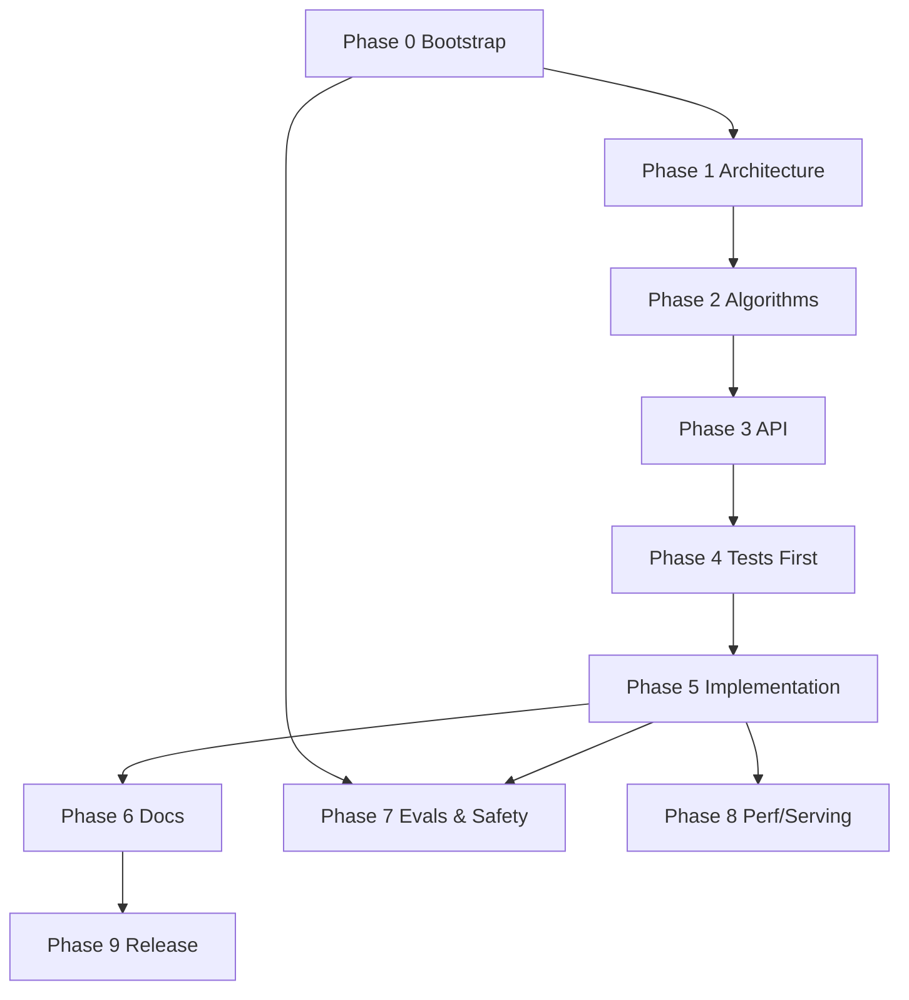

# Deterministic, Test‑Driven, Prompt‑First Development Workflow (C++20) — Source of Truth

**Project target:** Staff+‑quality, production‑grade C++20 code generated via LLM prompts, with *tests and docs first*.  
**Applies to:** Vesper (or any C++20 project with similar mandates).  
**Determinism:** All LLM generations use `temperature: 0.0`, `top_p: 1.0`, fixed `seed`, and strict output schemas; every change gated by evals.  
**Spec Pack (Primary Sources):** Architecture, Algorithms, Blueprint, API, Testing/Validation, References. (*All prompts below require attaching the spec pack as context*.)

**Status legend:** **(NOW)** implement immediately · **(SEQ)** next in sequence · **(LATER)** post‑V1/stretch.

---

## Conventions (apply to all prompts)
- **Decoding:** `temperature=0.0`, `top_p=1.0`, `n=1`; set `max_tokens` to 2× expected size.  
- **Formatting:** model must output *only* the requested artifact (e.g., JSON/YAML/Markdown or file tree). Use stop sequences to forbid extraneous text.  
- **Static constraints:** C++20; clang/gcc; `-fPIC -Wall -Wextra -Werror`; sanitize builds in CI; no exceptions on hot paths; prefer `std::expected` for error handling; `pmr` for arenas; AVX2/AVX‑512 feature‑gated; platform‑portable.  
- **Evaluation gates:** prompt‑blueprint metrics + project‑specific SLOs; unit tests must green; prompts linted; robustness evals pass minimums. citeturn0search7turn3search8

---

## Phase 0 — Bootstrap & Repository Contracts **(NOW)**

**Context.** Clean repo; spec pack present (`/specs/…`).  
**Objective.** Establish repo layout, schemas, linting, and CI scaffolding for prompt‑generated artifacts.  
**Depends‑On.** None.

**Prompts.**
- **A — Repository skeleton (YAML):** “Output a `repo.yaml` describing directories, file roles, and invariants; include semver for prompts; CI jobs for evals & security.”  
- **B — Schemas:** “Emit JSON Schema files for: `prompt.manifest.json`, `experiment.yaml`, `eval.report.json`. Include `$schema` URIs and examples.”  
- **C — CI pipeline:** “Produce a GitHub Actions workflow with stages: lint → build (C++20) → run tests → run evals (HELM/PromptBench/RAGAS) → upload reports → block on gates.” citeturn0search7turn3search8turn8search5

**Deliverables.** `/versioning/CHANGELOG.md`, `/experiments/schema/*`, CI workflows, `CONTRIBUTING.md` (prompt change policy).  
**Acceptance.** CI runs on PR; schema validation succeeds; empty project builds & passes lint.  
**Risks/Notes.** Ensure model cannot emit extra prose; enforce via JSON schema & stop sequences.  
**Out‑of‑Scope.** Feature code, benchmarks.

---

## Phase 1 — Architecture Record & Out‑of‑Process Design **(NOW)**

**Context.** Spec pack available.  
**Objective.** Freeze *architectural decisions* and invariants before code.  
**Depends‑On.** Phase 0.

**Prompts.**
- **A — ADRs (Markdown set):** “Summarize architecture as ADRs with: context, decision, consequences, alternatives, references.”  
- **B — Component map:** “Emit a Mermaid diagram + textual LLD for components, threading model, memory ownership, and error boundaries; align with spec pack.”  
- **C — Non‑functional SLOs:** “List latency, memory, throughput, and recovery SLOs with measurable acceptance tests.”

**Deliverables.** `/architecture/adr-*.md`, `/architecture/component-map.md`.  
**Acceptance.** ADRs reference spec pack and include traceability; reviewers sign‑off.

---

## Phase 2 — Algorithms Spec **(NOW)**

**Context.** Algorithms section in spec pack.  
**Objective.** Produce formal, testable algorithm descriptions (no code).  
**Depends‑On.** Phase 1.

**Prompts.**
- **A — Pseudocode (deterministic):** “For each algorithm, emit language‑agnostic pseudocode with pre/post‑conditions, complexity, and edge cases.”  
- **B — Test oracles:** “Define reference oracles/fixtures and numerical tolerances (ULPs) for kernels; specify SIMD feature flags; define seeds.”  
- **C — Failure modes:** “Enumerate adversarial and degenerate inputs; specify safe fallbacks and logging.”

**Deliverables.** `/algorithms/spec/*.md`, `/algorithms/fixtures/*.json`.  
**Acceptance.** Spec passes lint; ties back to ADRs.

---

## Phase 3 — Public API & ABI Contract **(SEQ)**

**Context.** API mandates in spec pack.  
**Objective.** Generate headers, C ABI, and error model before implementation.  
**Depends‑On.** Phase 2.

**Prompts.**
- **A — API headers (C++20):** “Generate `include/vesper/*.hpp` with Doxygen, concepts/traits, `std::expected` errors; no global new/delete; pmr‑aware.”  
- **B — Stable C ABI:** “Emit `vesper_c.h` with POD structs, versioning, and ownership rules.”  
- **C — Error taxonomy:** “Emit `errors.md` catalog with codes, remediation, and logging levels.”

**Deliverables.** Header set, ABI header, docs.  
**Acceptance.** Headers compile standalone (`-pedantic`); ABI free of STL types; docs generated.

---

## Phase 4 — Tests First **(SEQ)**

**Context.** Algorithms & API fixed.  
**Objective.** Write tests before code (unit, property, fuzz, perf micro‑bench).  
**Depends‑On.** Phase 3.

**Prompts.**
- **A — Unit tests:** “Generate GoogleTest/Catch2 suites covering API surfaces and algorithm fixtures; isolate SIMD via feature toggles.”  
- **B — Property tests:** “Emit property checks (e.g., triangle inequality for L2 kernels, idempotent recovery) with seeds & shrinking.”  
- **C — Fuzz harness:** “OSS‑Fuzz/libFuzzer targets for parsers and WAL; dictionaries & corpus; CI integration.”  
- **D — Perf micro‑bench:** “Google Benchmark harnesses with pinned affinity, warm‑ups, percentiles.”

**Deliverables.** `/tests/unit/*`, `/tests/property/*`, `/tests/fuzz/*`, `/bench/micro/*`.  
**Acceptance.** Tests compile and run (empty impls may be stubbed); CI green.

---

## Phase 5 — Implementation Generation **(SEQ)**

**Context.** Tests exist; prompts now ask the LLM to write *only* the code necessary to pass tests.  
**Objective.** Generate staff+‑quality C++20 code in small PRs, each gated by tests/evals.  
**Depends‑On.** Phase 4.

**Prompts.**
- **A — Module N implementation:** “Given headers + tests, implement `src/<module>.cpp`; respect perf constraints (no allocations in hot path; pmr arenas); include benchmarks.”  
- **B — SIMD kernels:** “Emit AVX2/AVX‑512 impl with scalar fallback; provide compile‑time dispatch; verify against fixtures within tolerance.”  
- **C — I/O & persistence:** “Implement WAL with checksums and crash‑safe `fsync`/`rename`; integration tests must pass.” citeturn2search5

**Deliverables.** `src/*` implementations with minimal surface.  
**Acceptance.** Unit + property + fuzz pass; micro‑bench meets SLOs.

---

## Phase 6 — Docs Generation **(SEQ)**

**Context.** APIs stable.  
**Objective.** Produce end‑user and operator docs from headers/tests.  
**Prompts.**
- **A — API Reference:** “Generate Doxygen/Sphinx pages; include examples drawn from tests.”  
- **B — Operator Guides:** “Install, config, tuning, troubleshooting; include safety considerations for prompts and RAG.”

**Deliverables.** `/docs/*`.  
**Acceptance.** Lint passes; examples compile; links resolve.

---

## Phase 7 — Evals, Robustness & Safety **(SEQ)**

**Context.** Prompt engineering around dev tools (assistants, codegen) and RAG components.  
**Objective.** Institutionalize evals and red teaming for prompts driving codegen and docs.  
**Depends‑On.** Phases 0–6.

**Prompts.**
- **A — HELM runbook:** “Emit YAML + scripts for standardized HELM runs; multi‑metric reports.” citeturn0search7  
- **B — PromptBench suite:** “Generate adversarial suites for system prompts (jailbreaks, injections), with gates.” citeturn3search8  
- **C — GAIA‑style agent tasks:** “Define tool‑use evals for code browsing/build/test automation.” citeturn3search9  
- **D — OWASP/NIST mapping:** “Map mitigations to LLM Top‑10 and AI‑RMF controls; include Microsoft guidance for indirect injection.” citeturn2search3turn2search5turn2search1

**Deliverables.** `/evals/*`, `/policies/*`.  
**Acceptance.** All gates satisfied; red‑team findings triaged with regressions added.

---

## Phase 8 — Performance & Serving (Optional for local tools) **(LATER)**

**Context.** If serving your own model/tooling.  
**Objective.** Optimize latency/throughput: batching, speculative decoding, KV cache (PagedAttention). citeturn6search2turn6search1  
**Prompts.** “Emit serving configs and load‑test scripts; record p50/p99 and cost.”

---

## Phase 9 — Release Engineering **(SEQ)**

**Objective.** Reproducible builds, SBOM, signatures, change logs.  
**Prompts.** “Generate release checklist, SBOM (SPDX), and artifact signatures; update `CHANGELOG.md`.”

---

## Milestones & Dependency Graph

**Milestones (checklist):**
- [ ] Phase 0 Bootstrap (NOW)  
- [ ] Phase 1 Architecture (NOW)  
- [ ] Phase 2 Algorithms (NOW)  
- [ ] Phase 3 API (SEQ)  
- [ ] Phase 4 Tests (SEQ)  
- [ ] Phase 5 Implementation (SEQ)  
- [ ] Phase 6 Docs (SEQ)  
- [ ] Phase 7 Evals & Safety (SEQ)  
- [ ] Phase 8 Perf/Serving (LATER)  
- [ ] Phase 9 Release (SEQ)

**Graph (Mermaid):**


**Source of Truth:** This roadmap governs sequencing, statuses, and PR gating; update statuses and link all tickets/PRs back here.  
**Notes:** For prompt‑generated code, attach the exact prompt, decoding params, and model hash to each PR to ensure reproducibility.

---

### Appendix — Prompt Template (per phase item)
```yaml
id: <unique-id>
context:
  spec_refs: ["/specs/architecture.md#...", "/specs/api.md#..."]
  constraints:
    - "C++20; -Wall -Wextra -Werror; portable"
    - "No exceptions in hot paths; use std::expected"
    - "Deterministic decoding: temperature=0.0, top_p=1.0, seed=23"
objective: "Generate <artifact> only"
prompts:
  A: |
    You are a staff+ C++20 engineer...
    # Inputs: <paste spec excerpts>
    # Output: <exact file(s) or JSON schema>
    # Invariants: <list>
    # Do not include commentary.
deliverables: ["<files>"]
acceptance:
  - "Compiles with C++20"
  - "All tests pass"
  - "Evals >= gates"
risks_notes:
  - "Model may emit prose; enforce via schema + stop seqs"
out_of_scope:
  - "New features beyond spec pack"
```

